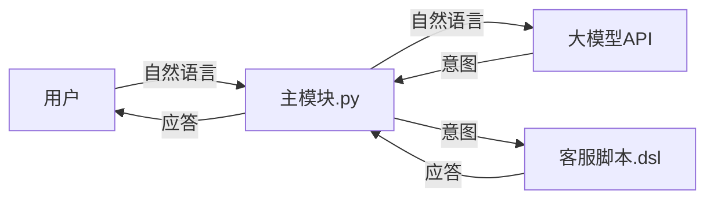

# 模块说明文档

## 项目概述

**简单DSL客服机器人**是一个基于领域特定语言（DSL）的智能对话系统，采用模块化设计实现自然语言处理与业务逻辑的分离。系统通过大模型API识别用户意图，并使用DSL脚本引擎生成相应的客服应答。

## 系统架构

```
用户输入 → 主模块 → 大模型API（意图识别） → DSL脚本引擎 → 生成回复 → 用户输出
```

## 模块详细说明

### 1. 主模块 (`主模块.py`)

**核心协调器，负责系统流程控制和模块间通信**

#### 功能职责：

- 系统初始化和模块协调
- 用户交互界面处理
- 对话流程控制
- 异常处理和程序生命周期管理

#### 核心方法：

- `main()`: 程序入口点，初始化系统并启动对话循环
- 处理用户输入、调用意图识别、执行脚本引擎、输出应答

#### 依赖关系：

- 调用 `LLMClient`进行意图识别
- 调用 `DSLEngine`执行脚本逻辑
- 直接与用户进行输入输出交互

------

### 2. 大模型API模块 (`llm_client.py`)

**智能意图识别模块，支持多种识别模式**

#### 功能职责：

- 连接大模型API进行自然语言理解
- 实现意图分类和识别
- 提供备用关键词匹配方案
- 错误处理和降级策略

#### 核心类：`LLMClient`

##### 主要方法：

- `recognize_intent(user_input, available_intents)`: 主识别接口
- `_llm_recognize_intent()`: 使用DeepSeek API进行智能识别
- `_fallback_recognize_intent()`: 关键词匹配备用方案

##### 特性：

- **双模式支持**：LLM API模式 + 关键词匹配模式
- **错误恢复**：API失败时自动降级到关键词匹配
- **意图验证**：确保返回意图在可用列表中
- **调试支持**：详细的日志输出

#### 配置参数：

- API端点：`https://ark.cn-beijing.volces.com/api/v3`
- 模型：`doubao-seed-1-6-251015`
- 温度参数：0.1（低随机性）

------

### 3. DSL脚本引擎模块 (`dsl_engine.py`)

**脚本解析与执行引擎，实现业务逻辑与代码分离**

#### 功能职责：

- 解析DSL脚本文件
- 管理场景和意图映射关系
- 执行脚本动作序列
- 提供默认脚本容错机制

#### 核心类：`DSLEngine`

##### 主要方法：

- `_load_script()`: 加载和解析DSL脚本文件
- `get_intents()`: 获取所有可用意图列表
- `process(intent, user_input)`: 处理意图并生成回复
- `_execute_actions()`: 执行动作序列（回复/日志）

##### DSL语法支持：

```
scene "场景名称"
intent "意图名称"
reply "回复内容"
log "日志信息"
```

##### 特性：

- **文件容错**：脚本文件缺失时使用内置默认脚本
- **灵活扩展**：支持多种动作类型（目前支持reply/log）
- **场景管理**：支持多场景意图组织

------

## 数据流说明

### 正常流程：

1. **用户输入** → 主模块接收自然语言
2. **意图识别** → 主模块调用LLMClient分类用户意图
3. **脚本执行** → 主模块将意图传递给DSLEngine
4. **动作执行** → DSLEngine查找匹配意图并执行相应动作
5. **回复生成** → 收集回复内容返回给用户

### 错误处理流程：

- **LLM API失败**：自动降级到关键词匹配模式
- **脚本文件缺失**：使用内置默认脚本继续运行
- **意图不匹配**：返回默认友好提示信息

------

## 配置要求

### 运行环境：

- Python 3.6+
- 依赖包：`openai`
- 网络连接（用于API调用）

### 文件结构：

```
项目根目录/
├── 主模块.py          # 主程序入口
├── llm_client.py      # 大模型API模块
├── dsl_engine.py      # DSL脚本引擎
└── script.dsl        # DSL脚本文件（可配置）
```

## 扩展性说明

### 意图扩展：

1. 在DSL脚本中添加新的`intent`定义
2. 在关键词映射表中添加对应关键词
3. 系统自动识别新意图

### 动作类型扩展：

在`DSLEngine._execute_actions()`方法中添加新的动作类型处理逻辑

### 识别模式扩展：

可通过修改`LLMClient`类支持更多的大模型提供商或识别算法

------

此模块化设计实现了关注点分离，使系统具有良好的可维护性和扩展性。各模块职责明确，接口清晰，便于独立测试和功能升级。
